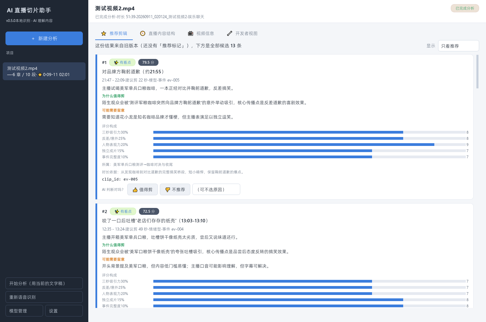
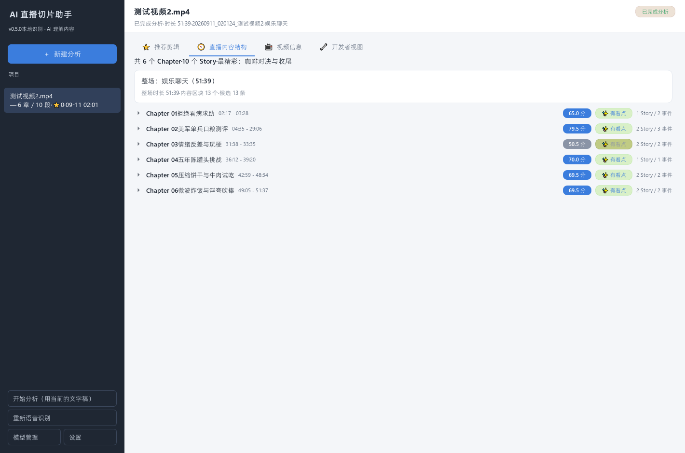
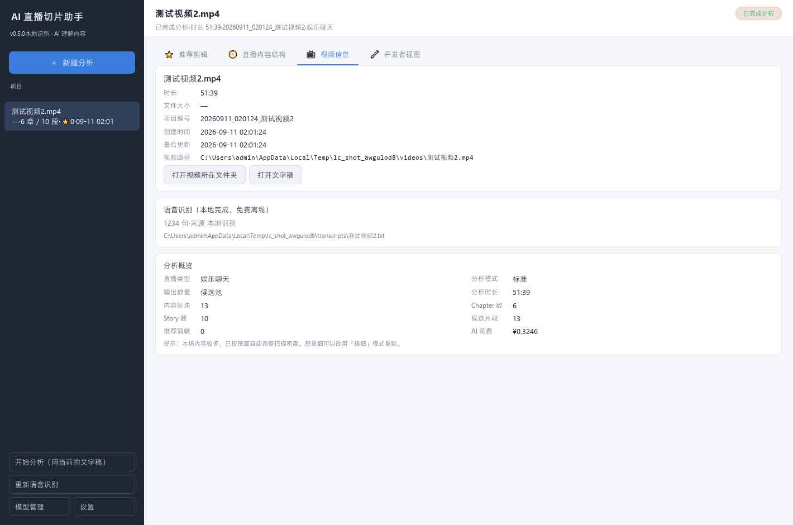
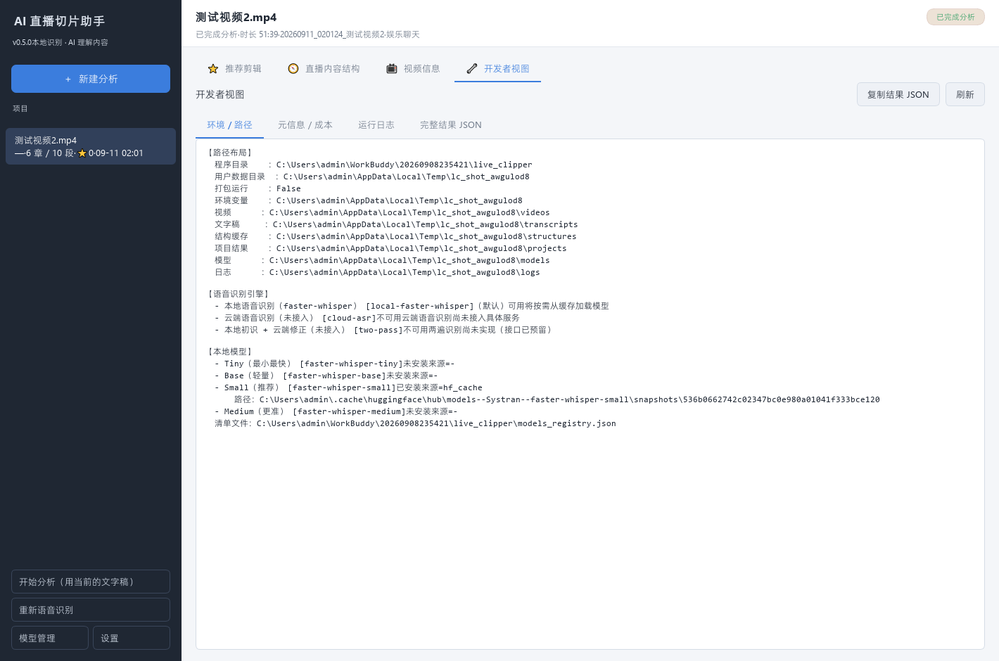

# AI Live Clipper

<p align="center">
  
</p>

<p align="center">
  <strong>AI 驱动的视频内容分析工具</strong><br>
  理解视频、语音、人物与内容价值，帮助创作者发现值得传播的高光时刻。
</p>

> 当前版本：**v0.5.3** · Release Candidate baseline<br>
> 当前阶段冻结功能范围，只进行发布维护，不包含 v0.5.4 或 v0.6 的开发内容。

## 项目介绍

AI Live Clipper 面向长视频、直播录像和内容创作者工作流，将媒体处理、语音识别和 AI 内容分析组织为可追踪的自动化流程。它不是聊天界面的包装，也不是传统时间线剪辑器；项目的重点是先理解内容，再输出可继续编辑和传播的结构化结果。

## 核心能力

- **视频分析**：读取媒体信息，建立视频、音频与内容结构。
- **语音识别**：基于 `faster-whisper` 生成带时间戳文字稿。
- **AI 高光发现**：分析内容价值，生成高光候选、评分和推荐片段。
- **智能剪辑基础能力**：输出可用于粗剪的时间范围、章节、故事与事件结构。
- **桌面产品体验**：DKN 品牌启动动画、无边框窗口、系统初始化和首次使用引导。
- **模块化扩展**：保留纠错、说话人识别、本地模型与云端 AI Provider 接口。

## 产品截图

| 推荐剪辑 | 内容结构 |
|---|---|
|  |  |

| 视频信息 | 开发者视图 |
|---|---|
|  |  |

更多界面截图见 [`docs/screenshots/`](docs/screenshots/)。

## 技术架构

```text
视频输入
   │
   ├─ FFmpeg ───────────────▶ 媒体探测 / 音频提取
   │
   ├─ faster-whisper ───────▶ 带时间戳文字稿
   │
   ├─ Correction / Speaker ─▶ 纠错与说话人能力
   │
   ├─ AI Model Interface ───▶ 高光、Chapter / Story / Event
   │
   └─ PySide6 Desktop UI ───▶ 项目与分析结果呈现
```

主要技术：

- Python
- PySide6 / Qt Quick / QML
- faster-whisper
- FFmpeg
- 可配置 AI 模型接口
- PyInstaller / Windows 安装程序

核心目录：

| 目录 | 职责 |
|---|---|
| `asr/` | 语音识别 Provider 与本地识别实现 |
| `analysis/` | 高光分析和内容结构生成 |
| `desktop/` | 桌面 UI、首次启动服务与后台任务 |
| `correction/` | 独立的 ASR 纠错模块 |
| `speaker/` | 说话人识别 Provider 模块 |
| `poc/` | 实验、评估脚本与人工标注基准 |
| `packaging/` | Windows 构建、安装与发行验收 |
| `docs/` | 架构、决策、版本基线和发行记录 |

完整目录职责见 [`PROJECT_STRUCTURE.md`](PROJECT_STRUCTURE.md)，架构说明见 [`docs/ARCHITECTURE.md`](docs/ARCHITECTURE.md)。

## 本地运行

当前开发与验收环境为 Windows x64、Python 3.14.7。

```powershell
python -m venv .venv
.\.venv\Scripts\python -m pip install -r requirements-dev.txt
.\.venv\Scripts\python desktop_app.py
```

命令行入口：

```powershell
.\.venv\Scripts\python main.py
```

Streamlit 网页入口：

```powershell
.\.venv\Scripts\streamlit run ui.py
```

## 配置与数据安全

- `.env.example` 只提供变量名称和占位符，不包含真实凭据。
- API Key、日志、模型、项目数据、运行输出和媒体文件不会提交到仓库。
- 桌面发行版的用户状态与设置写入 `%LOCALAPPDATA%\AILiveClipper`。
- Windows 安装包不进入源码历史，应上传到 GitHub Release Assets。

## 当前版本

### v0.5.3

- 完成 DKN / 夜雨声烦 / AI Live Clipper 品牌系统。
- 完成 PySide6 无边框桌面窗口和主界面基础结构。
- 完成 System Initialization 与 Welcome Setup 首次启动流程。
- 完成 ASR、AI 分析、纠错和 Speaker 模块的工程化基线。
- 完成 PyInstaller 构建、Windows 安装与 DPI 验收。

版本范围、已验证能力和限制见 [`docs/BASELINE_V053.md`](docs/BASELINE_V053.md) 与 [`docs/RELEASE_ACCEPTANCE_V053.md`](docs/RELEASE_ACCEPTANCE_V053.md)。

## Roadmap

- **v0.5.4**：UX 优化。
- **v0.6**：MVP 功能闭环，包括视频导入、高光展示和粗剪导出。

> Roadmap 仅描述后续方向；当前仓库发布任务不会提前开发这些功能。

## Developer

**夜雨声烦**<br>
DKN 独立开发者品牌
